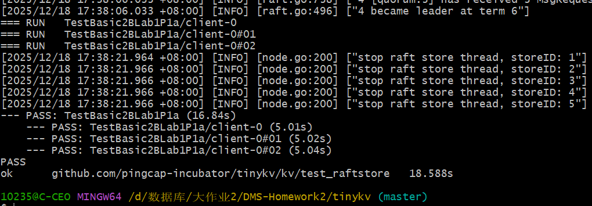
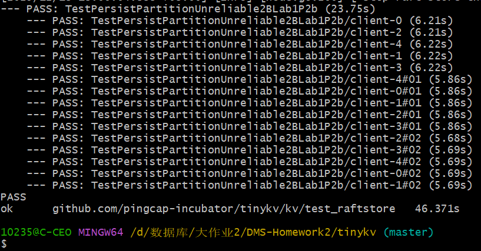
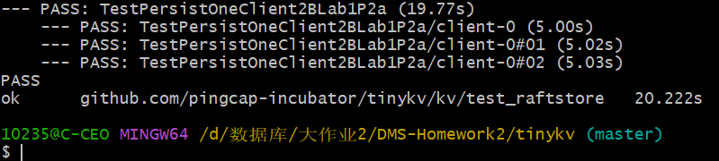
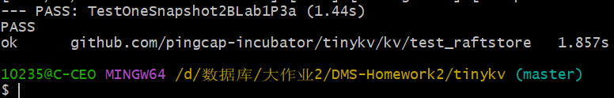
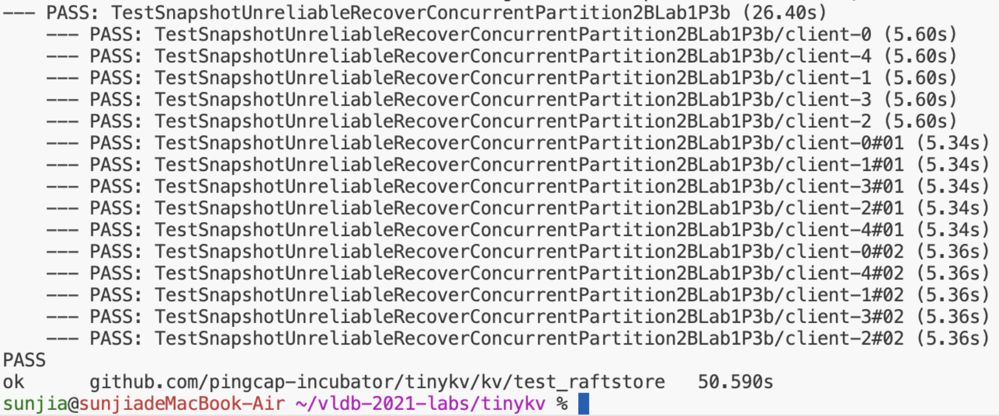
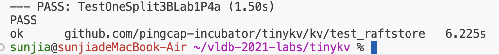
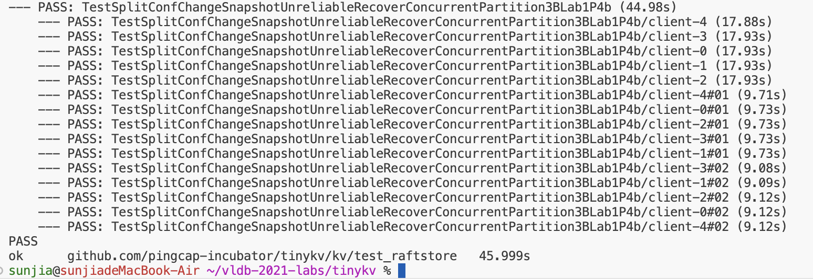

# 任务概述

### 这部分是小组两位成员共同完成

Lab1的任务是完成这个教学版数据管理系统的存储引擎，同时逐步了解这个数据管理系统的结构，实现`raftStore`和`storeEngine`。

`raftStore`为分布式存储提供基础设施，它处理请求并将日志发送到对应的`Raft Group`中。

`storeEngine`是lab1中我们主要需要实现的内容，这里我们可以参考`badger`存储引擎的实现，在它的基础上实现**列族**(Column Family)的功能，代码中的缩写一般为CF。

典型的存储引擎模式：读操作通过快照保证一致性，写操作通过批量操作保证原子性。

# 代码实现-StandaloneStorage
首先我们看一下各个模块分别是干什么的，lab1主要的代码位于`tinykv/kv`文件夹中，其存储引擎位于`storage`中，我们要实现的是StandaloneStorage中的`Reader`和`Write`函数。它们是`Storage`接口的一部分
``` go
// Storage represents the internal-facing server part of TinyKV, it handles sending and receiving from other
// TinyKV nodes. As part of that responsibility, it also reads and writes data to disk (or semi-permanent memory).
type Storage interface {
	Start(client scheduler_client.Client) error
	Stop() error
	Write(ctx *kvrpcpb.Context, batch []Modify) error
	Reader(ctx *kvrpcpb.Context) (StorageReader, error)
	Client() scheduler_client.Client
}
```
我们可以参考`MemStorage`中的相应实现，理解这两个函数的预期功能：
``` go
func (s *MemStorage) Reader(ctx *kvrpcpb.Context) (StorageReader, error) {
	return &memReader{s, 0}, nil
}

func (s *MemStorage) Write(ctx *kvrpcpb.Context, batch []Modify) error {
	for _, m := range batch {
		switch data := m.Data.(type) {
		case Put:
			item := memItem{data.Key, data.Value, false}
			switch data.Cf {
			case engine_util.CfDefault:
				s.CfDefault.ReplaceOrInsert(item)
			case engine_util.CfLock:
				s.CfLock.ReplaceOrInsert(item)
			case engine_util.CfWrite:
				s.CfWrite.ReplaceOrInsert(item)
			}
		case Delete:
			item := memItem{key: data.Key}
			switch data.Cf {
			case engine_util.CfDefault:
				s.CfDefault.Delete(item)
			case engine_util.CfLock:
				s.CfLock.Delete(item)
			case engine_util.CfWrite:
				s.CfWrite.Delete(item)
			}
		}
	}

	return nil
}
```

## Reader的实现
注意到StandaloneStorage中有一个实现了`StorageReader`的`BadgerReader`
``` go
type BadgerReader struct {
	txn *badger.Txn
}

func NewBadgerReader(txn *badger.Txn) *BadgerReader {
	return &BadgerReader{txn}
}

func (b *BadgerReader) GetCF(cf string, key []byte) ([]byte, error) {
	val, err := engine_util.GetCFFromTxn(b.txn, cf, key)
	if err == badger.ErrKeyNotFound {
		return nil, nil
	}
	return val, err
}

func (b *BadgerReader) IterCF(cf string) engine_util.DBIterator {
	return engine_util.NewCFIterator(cf, b.txn)
}

func (b *BadgerReader) Close() {
	b.txn.Discard()
}
```
同时，在教程中提到了
	 You should use [badger.Txn](https://godoc.org/github.com/dgraph-io/badger#Txn) to implement the `Reader` function because the transaction handler provided by badger could provide a consistent snapshot of the keys and values.

badger.Txn是badger的事务处理类型，在[前置知识：BadgerDB](./badger.md)中我们提到过其基本使用方法，由于Reader只需要用到只读事务，所以我们代码如下：
``` go
func (s *StandAloneStorage) Reader(ctx *kvrpcpb.Context) (storage.StorageReader, error) {
	// YOUR CODE HERE (lab1).
	return NewBadgerReader(s.db.NewTransaction(false)), nil
}
```

## Write的实现
首先我们看代码中的提示：

	Try to check the definition of `storage.Modify` and txn interface of `badger`.
	As the column family is not supported by `badger`, a wrapper is used to 
	simulate it.

所以，我们主要关注`storage.Modify`接口以及`badger`的`txn`事务处理。
在modify.go中定义了`Modify`接口
``` go
package storage

// Modify is a single modification to TinyKV's underlying storage.
type Modify struct {
	Data interface{}
}

type Put struct {
	Key   []byte
	Value []byte
	Cf    string
}

type Delete struct {
	Key []byte
	Cf  string
}

func (m *Modify) Key() []byte {
	switch m.Data.(type) {
	case Put:
		return m.Data.(Put).Key
	case Delete:
		return m.Data.(Delete).Key
	}
	return nil
}

func (m *Modify) Value() []byte {
	switch m.Data.(type) {
	case Put:
		return putData.Value
	case Delete:
		return nil
	}
	return nil
}

func (m *Modify) Cf() string {
	switch m.Data.(type) {
	case Put:
		return m.Data.(Put).Cf
	case Delete:
		return m.Data.(Delete).Cf
	}
	return ""
}

```
这里的Data可以是`Put`也可以是`Delete`。它们分别定义了修改和删除的接口。
`util`中提供了相应的wrapper使得我们能够方便地操作列族，同时，它们在内部使用了Update方法，这使得我们不需要手动新建tnx对象。
``` go
func (s *StandAloneStorage) Write(ctx *kvrpcpb.Context, batch []storage.Modify) error {
	// YOUR CODE HERE (lab1).
	// Try to check the definition of `storage.Modify` and txn interface of `badger`.
	// As the column family is not supported by `badger`, a wrapper is used to simulate it.

	for _, m := range batch {
		switch data := m.Data.(type) {
		case storage.Put:
			engine_util.PutCF(s.db, data.Cf, data.Key, data.Value)
		case storage.Delete:
			engine_util.DeleteCF(s.db, data.Cf, data.Key)
		}
	}
	return nil
}
```
这里是`PutCF`和`DeleteCF`的具体代码，已经创建了一个`txn`。
``` go
func PutCF(engine *badger.DB, cf string, key []byte, val []byte) error {
	return engine.Update(func(txn *badger.Txn) error {
		return txn.Set(KeyWithCF(cf, key), val)
	})
}

func DeleteCF(engine *badger.DB, cf string, key []byte) error {
	return engine.Update(func(txn *badger.Txn) error {
		return txn.Delete(KeyWithCF(cf, key))
	})
}
```


## 测试结果


# 代码实现-RaftStorage
接下来我们需要实现基于Raft的分布式存储。这里的相关内容在作业的readme中有详细的描述

在 RaftStorage 部分，我补全了 TinyKV raftstore 的关键链路：首先在 proposeRaftCommand 中完成请求的合法性检查、region/peer 停止状态处理，并将请求绑定当前 term 后通过 Propose 提交到 Raft 日志。随后在 HandleRaftReady 中实现 Ready 的完整处理流程：无 Ready 直接返回；对 Ready 先持久化（调用 SaveReadyState），再按 Leader/Follower 角色发送消息，并根据是否包含 snapshot 决定投递 ApplyRefresh 或 ApplyCommitted；最后调用 Advance 推进 RawNode 状态，避免 Ready 堵塞。最后在 PeerStorage 中实现 Append 与 SaveReadyState：将 entries 按 index 写入 raft log、删除冲突尾部日志并更新 LastIndex/LastTerm，同时持久化 HardState，并将 kv/raft 两个 write batch 落盘，保证崩溃恢复与复制一致性。
```
1.1 写请求进入 Raft（Propose 路径）
[客户端请求 RaftCmdRequest]
        |
        v
peer_msg_handler.proposeRaftCommand(msg, cb)
   |
   |-- (1) preProposeRaftCommand(msg)  校验请求合法性
   |         - 不合法：cb.Done(ErrResp(err)) 直接返回
   |
   |-- (2) stopped?  peer已销毁/region removed
   |         - 是：NotifyReqRegionRemoved(regionID, cb) 返回
   |
   |-- (3) term + resp 绑定
   |         BindRespTerm(resp, d.Term())
   |
   `-- (4) Propose(engine.Kv, cfg, cb, msg, resp)
             -> 形成 raft log entry，进入 RaftGroup
```

proposeRaftCommand 把“客户端命令”变成“Raft 日志提议”，之后能否生效取决于是否被多数派提交并 apply。
```
1.2 Raft 输出 Ready 的处理（Ready 路径）
peer.HandleRaftReady(...)
   |
   |-- (0) HasReady? 没有则直接 return
   |
   |-- ready := RaftGroup.Ready()
   |-- leader?  先并发 Send(ready.Messages)（优化）
   |
   |-- applySnapResult := peerStorage.SaveReadyState(&ready)
   |      |
   |      |-- SaveReadyState:
   |      |     a) Snapshot? ApplySnapshot -> 写 kvWB + raftWB
   |      |     b) Entries?  Append(entries, raftWB)   (写 raft log)
   |      |     c) HardState? 持久化 raftStateKey
   |      |     d) kvWB.WriteTo(Kv) + raftWB.WriteTo(Raft)
   |      |
   |
   |-- follower?  Send(ready.Messages)（严格“先落盘后发消息”）
   |
   |-- apply 分支：
   |      |
   |      |-- 有 snapshot：发 MsgTypeApplyRefresh（通知apply worker刷新）
   |      |
   |      `-- 否则：取 ready.CommittedEntries
   |               -> 发 MsgTypeApplyCommitted（让apply worker按序apply）
   |
   `-- RaftGroup.Advance(ready)   (推进 RawNode 状态机，必须做)
```
HandleRaftReady 是把 Ready 按“先持久化→再发消息→再 apply→最后 Advance”的顺序处理，确保崩溃恢复安全与副本一致。


## 代码层次
主要的代码位于tinykv/kv/raftstore目录中。需要实现的代码分布在如下几个文件中：
- `kv/raftstore/peer_msg_handler.go`，`proposeRaftCommand` 方法，这是读写请求提议的核心部分。
- `kv/raftstore/peer.go`，`HandleRaftReady` 方法，这是 Raft Ready 处理的核心部分。
- `kv/raftstore/peer_storage.go`，`SaveReadyState` 方法，这是状态和日志持久化的核心部分。
- `kv/raftstore/peer_storage.go`，`Append` 方法，它将 Raft Ready 中的日志附加到日志引擎。

每个部分的代码都有详细的提示，我们照着实现即可。

这一部分的任务主要围绕着`Ready`这个结构体展开，它有着如下的字段：
``` go
// Ready encapsulates the entries and messages that are ready to read,
// be saved to stable storage, committed or sent to other peers.
// All fields in Ready are read-only.
type Ready struct {
	// The current volatile state of a Node.
	// SoftState will be nil if there is no update.
	// It is not required to consume or store SoftState.
	*SoftState

	// The current state of a Node to be saved to stable storage BEFORE
	// Messages are sent.
	// HardState will be equal to empty state if there is no update.
	pb.HardState

	// Entries specifies entries to be saved to stable storage BEFORE
	// Messages are sent.
	Entries []pb.Entry

	// Snapshot specifies the snapshot to be saved to stable storage.
	Snapshot pb.Snapshot

	// CommittedEntries specifies entries to be committed to a
	// store/state-machine. These have previously been committed to stable
	// store.
	CommittedEntries []pb.Entry

	// Messages specifies outbound messages to be sent AFTER Entries are
	// committed to stable storage.
	// If it contains a MessageType_MsgSnapshot message, the application MUST report back to raft
	// when the snapshot has been received or has failed by calling ReportSnapshot.
	Messages []pb.Message
}

```
这里我们需要弄清楚各个字段代表的不同含义：
- `SoftState` 软状态，指的是那些没有被持久化的状态，比如当前节点的角色等
- `HardState` 硬状态，与软状态相对应，指的是那些已经被持久化的状态，如`Term`,`Vote`,`Commit`等信息，这些内容的持久化可以保证节点重启或意外关机后的状态恢复
- `Entries` 需要提交的日志条目
- `Snapshot` 节点的快照
- `CommitedEntries` 已经提交的日志条目
- `Messages` 需要发送给其他节点的`Raft`消息
当不需要更新状态时，`SoftState`和`HardState`都会为`nil`，这和我们后面的函数体内部处理`Ready`信息有关。
## `peer`

`peer`中我们需要完成`HandleRaftReady`，这个函数用来处理`Ready`消息，并同步当前peer的状态。
``` go
func (p *peer) HandleRaftReady(msgs []message.Msg, pdScheduler chan<- worker.Task, trans Transport) (*ApplySnapResult, []message.Msg) {
	if p.stopped {
		return nil, msgs
	}

	if p.HasPendingSnapshot() && !p.ReadyToHandlePendingSnap() {
		log.Debug(fmt.Sprintf("%v [apply_id: %v, last_applying_idx: %v] is not ready to apply snapshot.", p.Tag, p.peerStorage.AppliedIndex(), p.LastApplyingIdx))
		return nil, msgs
	}

	// YOUR CODE HERE (lab1). There are some missing code pars marked with `Hint` above, try to finish them.
	// Hint1: check if there's ready to be processed, if no return directly.
	// panic("not implemented yet")
	if !p.RaftGroup.HasReady() {
		return nil, msgs
	}

	// Start to handle the raft ready.
	log.Debug(fmt.Sprintf("%v handle raft ready", p.Tag))

	ready := p.RaftGroup.Ready()
	// TODO: workaround for:
	//   in kvproto/eraftpb, we use *SnapshotMetadata
	//   but in etcd, they use SnapshotMetadata
	if ready.Snapshot.GetMetadata() == nil {
		ready.Snapshot.Metadata = &eraftpb.SnapshotMetadata{}
	}

	// The leader can write to disk and replicate to the followers concurrently
	// For more details, check raft thesis 10.2.1.
	if p.IsLeader() {
		p.Send(trans, ready.Messages)
		ready.Messages = ready.Messages[:0]
	}
	ss := ready.SoftState
	if ss != nil && ss.RaftState == raft.StateLeader {
		p.HeartbeatScheduler(pdScheduler)
	}

	applySnapResult, err := p.peerStorage.SaveReadyState(&ready)
	if err != nil {
		panic(fmt.Sprintf("failed to handle raft ready, error: %v", err))
	}
	if !p.IsLeader() {
		p.Send(trans, ready.Messages)
	}

	if applySnapResult != nil {
		/// Register self to applyMsgs so that the peer is then usable.
		msgs = append(msgs, message.NewPeerMsg(message.MsgTypeApplyRefresh, p.regionId, &MsgApplyRefresh{
			id:     p.PeerId(),
			term:   p.Term(),
			region: p.Region(),
		}))

		// Snapshot's metadata has been applied.
		p.LastApplyingIdx = p.truncatedIndex()
	} else {
		committedEntries := ready.CommittedEntries
		ready.CommittedEntries = nil
		l := len(committedEntries)
		if l > 0 {
			p.LastApplyingIdx = committedEntries[l-1].Index
			msgs = append(msgs, message.Msg{Type: message.MsgTypeApplyCommitted, Data: &MsgApplyCommitted{
				regionId: p.regionId,
				term:     p.Term(),
				entries:  committedEntries,
			}, RegionID: p.regionId})
		}
	}

	// YOUR CODE HERE (lab1). There are some missing code pars marked with `Hint` above, try to finish them.
	// Hint2: Try to advance the states in the raft group of this peer after processing the raft ready.
	//        Check about the `Advance` method in for the raft group.
	// panic("not implemented yet")
	p.RaftGroup.Advance(ready)
	return applySnapResult, msgs
}
```
首先，这个函数会检查是否有`Ready`信息需要我们进行处理，如果有的话，我们根据当前节点角色是`Leader`还是`Follower`来执行不同的操作，但是最终都会使用`peer_storage`的`SaveReadyState`函数来进行持久化的处理。这里`SaveReadyState`的返回值用来表示我们是否应用了快照，如果应用了快照的话，我们发送的消息就是快照中的相关信息，否则，我们发送的是追加了相关的日志条目后的相关信息。
在最后，函数还会调用`Advance`方法来更新当前`RawNode`的状态。
## `peer_msg_handler`

实现`peerMsgHandler`部分，这里面只有`proposeRaftCommand`是我们需要去实现的。
注释中的提示信息已经很详细了，我们按部就班去做就可以

### 第一步
我们需要确认命令是否有效，代码中已经提供了`preProposeRaftCommand`函数，我们直接调用它即可
### 第二步
判断当前节点是否已经停止，如果已经停止则使用`NotifyReqRegionRemoved`来通知错误
### 第三步
将任期和response绑定起来生成`propose`，然后提交这个`propose`，
``` go
type GlobalContext struct {
	cfg                  *config.Config
	engine               *engine_util.Engines
	store                *metapb.Store
	storeMeta            *storeMeta
	snapMgr              *snap.SnapManager
	router               *router
	trans                Transport
	schedulerTaskSender  chan<- worker.Task
	regionTaskSender     chan<- worker.Task
	raftLogGCTaskSender  chan<- worker.Task
	splitCheckTaskSender chan<- worker.Task
	schedulerClient      scheduler_client.Client
	tickDriverSender     chan uint64
}
```
提示中让我们注意ctx的结构，我们需要注意这里面的`store`和`cfg`即可，这是我们调用`Propose`函数的必要参数。
### 最终代码
``` go
func (d *peerMsgHandler) proposeRaftCommand(msg *raft_cmdpb.RaftCmdRequest, cb *message.Callback) {
	// panic("not implemented yet")
	// YOUR CODE HERE (DONE).
	// Hint1: do `preProposeRaftCommand` check for the command, if the check fails, need to execute the
	// callback function and return the error results. `ErrResp` is useful to generate error response.
	err := d.preProposeRaftCommand(msg)
	if err != nil {
		cb.Done(ErrResp(err))
		return
	}

	// Hint2: Check if peer is stopped already, if so notify the callback that the region is removed, check
	// the `destroy` function for related utilities. `NotifyReqRegionRemoved` is useful to generate error response.
	if d.stopped {
		err := d.Destroy(d.ctx.engine, false)
		if err != nil {
			NotifyReqRegionRemoved(d.regionId, cb)
		}
		return
	}

	// Hint3: Bind the possible response with term then do the real requests propose using the `Propose` function.
	// Note:
	// The peer that is being checked is a leader. It might step down to be a follower later. It
	// doesn't step down to be a follower later. It
	// doesn't matter whether the peer is a leader or not. If it's not a leader, the proposing
	// command log entry can't be committed. There are some useful information in the `ctx` of the `peerMsgHandler`.

	// 构造Propose
	term := d.Term()
	resp := raft_cmdpb.RaftCmdResponse{}
	BindRespTerm(&resp, term)

	// 提交Propose
	d.Propose(d.ctx.engine.Kv, d.ctx.cfg, cb, msg, &resp)
}
```
通过将日志与任期绑定起来，我们可以确定是否接受这个propose。
## `peer_storage`
这部分的代码主要用于实现Raft协议中的日志提交和状态机更新的部分。我们需要完成`Append`和`SaveReadyAppend`两个函数，这两个函数分别对应了日志提交和状态机更新两个任务。

### `Append`函数
Raft中更新Entry的机制是：首先将RPC中的`Index`和`Term`与自己维护的`Index`和`Term`作匹配，若无法匹配，则说明日志出现了冲突，如果出现了`Term`冲突，那么我们会强制删除过期的`Term`所对应的日志并用较新的`Entry`进行覆盖。这里使用Raft论文中的图进行解释

在`Term 8`开始时，`Leader`保存的日志信息如最上面的一部分所展示的一样，由于`Term 8`大于这其中任何一项日志记录的`Term`序号，因此所有的冲突日志会被覆盖掉，使得集群中所有节点的状态与其保持一致。这些步骤是通过`Term`和`Index`的大小比较等操作完成的。

`Append`函数的主要逻辑分为两步，第一步，把传入的`Entry`添加到日志中，第二步，运用上面的方法处理可能存在的冲突，由于在处理冲突时需要用到某一个`Entry`的`Index`信息和`Term`信息，因此存入`Entry`时我们使用这两个信息来标识它，也就是说，我们在日志中添加一个kv对，其中键为`Index`信息和`Term`信息，值为某一个`Entry`。
``` go
func (ps *PeerStorage) Append(entries []eraftpb.Entry, raftWB *engine_util.WriteBatch) error {
	log.Debug(fmt.Sprintf("%s append %d entries", ps.Tag, len(entries)))
	prevLastIndex := ps.raftState.LastIndex
	if len(entries) == 0 {
		return nil
	}
	lastEntry := entries[len(entries)-1]
	lastIndex := lastEntry.Index
	lastTerm := lastEntry.Term
	// panic("not implemented yet")
	// YOUR CODE HERE (lab1).
	for _, entry := range entries {
		// Hint1: in the raft write batch, the log key could be generated by `meta.RaftLogKey`.
		//       Also the `LastIndex` and `LastTerm` raft states should be updated after the `Append`.
		//       Use the input `raftWB` to save the append results, do check if the input `entries` are empty.
		//       Note the raft logs are stored as the `meta` type key-value pairs, so the `RaftLogKey` and `SetMeta`
		//       functions could be useful.
		key := meta.RaftLogKey(ps.region.GetId(), entry.Index)
		raftWB.SetMeta(key, &entry)

		log.Debug(fmt.Sprintf("entry=%v", entry))
	}

	for i := lastIndex + 1; i <= prevLastIndex; i++ {
		// Hint2: As the to be append logs may conflict with the old ones, try to delete the left
		//       old ones whose entry indexes are greater than the last to be append entry.
		//       Delete these previously appended log entries which will never be committed.
		key := meta.RaftLogKey(ps.region.GetId(), i)
		raftWB.DeleteMeta(key)
	}

	ps.raftState.LastIndex = lastIndex
	ps.raftState.LastTerm = lastTerm
	return nil
}
```
在完成写入后，还需要更新当前节点保存的`lastIndex`和`lastTerm`以便下一次处理冲突时使用。

### `SaveReadyState`函数
前面的`Append`函数只是更新了日志在内存中的状态，而在日志提交后，我们还需要把它存入磁盘中进行持久化，这也就是`SaveReadyState`函数所做的工作。
`SaveReadyState`需要完成如下的工作：
- 检查是否有快照，如果有快照那么接下来需要进行持久化。
- 检查当前消息，如果消息中带有日志项，我们需要把它Append进来，具体的操作逻辑在Append函数内部进行。
- 如果硬状态不为空，则我们需要把硬状态更新为ready信息中的状态。
- 将这些操作持久化到硬盘中。

``` go
// SaveReadyState processes the ready generated by the raft instance, the main task is to send raft messages
// to other peers, and persist the entries. The raft log entries will be saved to the raft kv, and the
// snapshot will be applied to the region worker will be handled by the region worker.
//
// Save memory states to disk.
//
// Do not modify ready in this function, this is a requirement to advance the ready object properly later.
func (ps *PeerStorage) SaveReadyState(ready *raft.Ready) (*ApplySnapResult, error) {
	kvWB, raftWB := new(engine_util.WriteBatch), new(engine_util.WriteBatch)
	prevRaftState := ps.raftState
	var applyRes *ApplySnapResult = nil
	var err error
	if !raft.IsEmptySnap(&ready.Snapshot) {
		applyRes, err = ps.ApplySnapshot(&ready.Snapshot, kvWB, raftWB)
		if err != nil {
			return nil, err
		}
	}
	// panic("not implemented yet")
	// YOUR CODE HERE (lab1).
	// Hint: the outputs of the raft ready are: snapshot, entries, states, try to process
	//       them correctly. Note the snapshot apply may need the kv engine while others will
	//       always use the raft engine.
	if len(ready.Entries) != 0 {
		// Hint1: Process entries if it's not empty.
		ps.Append(ready.Entries, raftWB)
	}

	// Last index is 0 means the peer is created from raft message
	// and has not applied snapshot yet, so skip persistent hard state.
	if ps.raftState.LastIndex > 0 {
		// Hint2: Handle the hard state if it is NOT empty.
		if !raft.IsEmptyHardState(ready.HardState) {
			*ps.raftState.HardState = ready.HardState
			raftWB.SetMeta(meta.RaftStateKey(ps.region.GetId()), &ps.raftState)
		}
	}

	if !proto.Equal(&prevRaftState, &ps.raftState) {
		raftWB.SetMeta(meta.RaftStateKey(ps.region.GetId()), &ps.raftState)
	}

	kvWB.MustWriteToDB(ps.Engines.Kv)
	raftWB.MustWriteToDB(ps.Engines.Raft)
	return applyRes, nil
}
```
这里返回的`applyRes`用于说明我们是否应用了快照，这个结果将会在`peer`的`HandleRaftReady`中用于

## 测试结果
**Part1 A**



**Part1 B**


**Part2 A**


**Part2 B**


**Part3 A**


**Part3 B**


**Part4 A**


**Part4 B**



