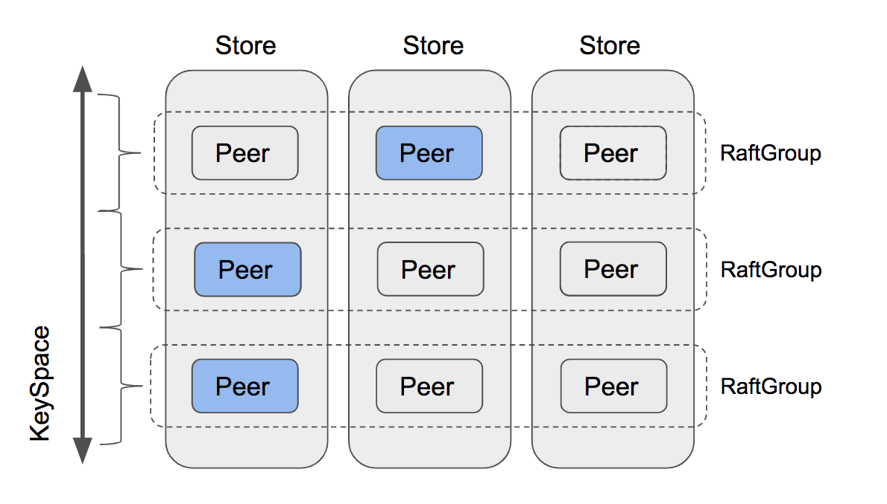
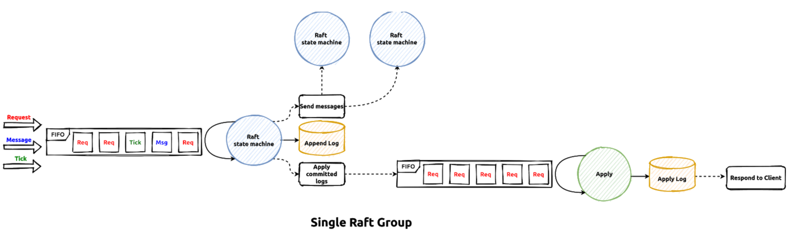

# TinyKV Lab 1 专题报告：Raft 算法实现与集成

## 一、 Raft 算法核心概念

在分布式系统中，确保数据的一致性和持久性是核心挑战。TinyKV 引入了 **Raft 共识算法**来解决多副本之间的数据同步和故障容忍问题。本报告将深入探讨 Raft 算法的原理，以及如何在 TinyKV 中集成和实现 `RaftStorage` 模块。

### 1.1 分布式持久化挑战

*   **单机限制**：单机数据库通过本地日志（如 redo log）保证持久性，但无法抵御单点故障。
*   **多副本需求**：分布式系统通过数据副本提供容错能力。核心问题是如何在多个副本间保持数据一致，尤其是在网络分区和节点故障时。

### 1.2 Raft 共识算法

Raft 是一种易于理解的、用于管理复制日志的共识算法。它通过选举 Leader、日志复制和安全性保障机制，确保在大多数节点存活的情况下，分布式系统能提供高可用和强一致的服务。



_图 1.1 Raft 协议在分布式存储中的应用_

### 1.3 Raft 状态机与 `RawNode`、`Ready`

TinyKV 利用 `etcd/raft` 库提供的 Raft 实现。理解 `RawNode` 和 `Ready` 是集成 Raft 的关键。

*   **`RawNode`**：`etcd/raft` 库中 Raft 算法的核心实现。它是一个状态机，负责 Raft 算法的逻辑，如 Leader 选举、日志复制决策等，但它不直接处理 I/O 操作（如日志存储到磁盘、网络消息的发送）。
*   **`Ready`**：`RawNode` 的核心输出。每次调用 `RawNode.Ready()`，都会返回一个 `Ready` 结构体。这个结构体包含了应用层需要处理的所有信息，可以看作是 `RawNode` 向外界发出的“指令集”：
    *   **`HardState`**：Raft 节点需要持久化的状态，包括 `current Term`、`votedFor` 和 `commit` 索引。
    *   **`Entries`**：需要持久化到日志存储（Raft DB）的新日志条目。
    *   **`CommittedEntries`**：已经被 Raft 多数派提交，可以安全地应用到状态机（Kv DB）的日志条目。
    *   **`Messages`**：需要通过网络发送给其他 Raft 节点的 Raft 协议消息。
    *   **`Snapshot`**：需要应用到状态机的 Raft 快照。

应用层（例如 TinyKV 的 `raftWorker`）通过不断循环调用 `RawNode.Ready()` 来驱动 Raft 状态机前进，并根据 `Ready` 中的内容执行相应的 I/O 操作。



_图 1.2 RaftStore 内部工作流程_

## 二、 `RaftStorage` 核心功能实现

`RaftStorage` 模块的实现主要围绕如何正确地与 `RawNode` 交互，处理 `Ready` 对象中包含的各种状态和数据。

### 2.1 `proposeRaftCommand` (`peer_msg_handler.go`)

*   **`peer_msg_handler.go` - `proposeRaftCommand` 方法代码：**

    ```go
    func (d *peerMsgHandler) proposeRaftCommand(msg *raft_cmdpb.RaftCmdRequest, cb *message.Callback) {
        // ADD: 执行前置检查，确保命令可以被提议
        err := d.preProposeRaftCommand(msg)
        if err != nil {
            cb.Done(ErrResp(err))
            return
        }
        // ADD: 检查Peer是否已停止，防止无效操作
        if d.stopped {
            err := d.Destroy(d.ctx.engine, false)
            if err != nil {
                NotifyReqRegionRemoved(d.regionId, cb)
            }
            return
        }
        // ADD: 获取当前Term，用于安全性验证
        term := d.Term()
        resp := raft_cmdpb.RaftCmdResponse{}
        // ADD: 将Term绑定到响应，确保客户端校验
        BindRespTerm(&resp, term)
        // ADD: 调用Propose方法，将请求提交给Raft模块
        d.Propose(d.ctx.engine.Kv, d.ctx.cfg, cb, msg, &resp)
    }
    ```

*   **实现讲解**：
    *   **目的**：将外部（客户端）发起的 `RaftCmdRequest` 转化为 Raft 日志提议 (Propose)，并提交给底层的 `RawNode` (`d.RaftGroup`)。
    *   **前置检查**：在将请求提议给 Raft 之前，必须进行一系列必要的检查。例如，当前 `Peer` 必须是 Raft Group 的 Leader 才能提议新的日志；`Peer` 自身也不能处于停止状态。如果检查失败，会通过回调 `cb.Done()` 立即返回错误。
    *   **`BindRespTerm(&resp, term)`**：这是一个安全性措施。在 Raft 协议中，`Term` 是一个递增的逻辑时间单位。将当前 Leader 的 `Term` 包含在响应中，允许客户端验证响应的有效性。如果客户端收到的响应 `Term` 小于其已知的 `Term`，则可能意味着该响应来自一个已下台的 Leader，从而避免客户端处理过期或无效的信息。
    *   **`d.Propose(...)`**：这是将请求提交给 Raft 模块的核心操作。`d.Propose` 函数会将 `RaftCmdRequest` 序列化为一个 `eraftpb.Entry`（Raft 日志条目），然后调用 `d.RaftGroup.Propose(...)`，将这条日志条目提议给 `RawNode`。`RawNode` 随后会处理日志的复制和多数派确认。

### 2.2 `HandleRaftReady` (`peer.go`)

*   **`peer.go` - `HandleRaftReady` 方法（简化版）代码：**

    ```go
    func (p *peer) HandleRaftReady(rd raft.Ready, applySnapResult *raftstore.ApplySnapResult, msgs []raftstore.Msg) (*raftstore.ApplySnapResult, []raftstore.Msg) {
        // ... (省略 Ready 获取和前置处理部分) ...

        // ADD: 检查是否有Ready需要处理，避免不必要的操作
        if !p.RaftGroup.HasReady() {
            return nil, msgs
        }

        // ADD: 持久化Ready中的状态，这是最关键的持久化步骤
        applySnapResult, err := p.peerStorage.SaveReadyState(&rd)
        if err != nil {
            // 处理错误
            return nil, nil // 示例错误处理
        }

        // ADD: 发送Raft消息，维持集群通信
        msgs = append(msgs, p.getMessagesFromReady(rd)...)

        // ADD: 将已提交的日志应用到Kv存储
        if len(rd.CommittedEntries) > 0 {
            p.sendApplyCommittedMsgs(rd.CommittedEntries)
        }

        // ADD: 通知RaftGroup已处理完当前Ready，驱动状态机前进
        p.RaftGroup.Advance(rd)

        return applySnapResult, msgs
    }
    ```

*   **实现讲解**：
    *   **目的**：`HandleRaftReady` 是 `Raft` 状态机在应用层的主循环。它负责获取 `RawNode` 生成的 `Ready` 对象，并协调处理 `Ready` 中包含的所有状态和数据。
    *   **`p.peerStorage.SaveReadyState(&rd)`**：这是 `HandleRaftReady` 中的核心调用，它将 `Ready` 对象中所有需要持久化的数据（包括 `rd.Entries`、`rd.HardState` 和 `rd.Snapshot`）委派给 `peer_storage` 模块进行写入。`SaveReadyState` 会将这些数据写入到 `Raft` DB（日志存储）和 `Kv` DB（状态机存储）。
    *   **Raft 消息发送**：`rd.Messages` 包含了 `RawNode` 需要发送给其他 `Raft` 节点的网络消息。这些消息必须通过网络层发送出去，以维持 `Raft` 协议的通信。通常，Leader 可以在持久化新日志前发送消息（以优化性能），而 Follower 必须在日志持久化后才能发送（以保证安全性）。
    *   **`rd.CommittedEntries`**：这是 `Ready` 对象中最重要的部分之一。`CommittedEntries` 包含了已经被 Raft 多数派确认提交的日志条目。这些日志条目必须严格按照它们在日志中的顺序，原子地应用到底层的 `Kv` 存储（状态机）中，从而改变实际数据。通常，这些日志条目会被封装成 `MsgApplyCommitted` 消息，异步地发送给 `applyWorker` 去处理，以避免阻塞 `Raft` 主循环。
    *   **`p.RaftGroup.Advance(rd)`**：**此步骤至关重要**。它通知底层的 `RawNode`，当前 `Ready` 对象中包含的所有信息都已经由应用层成功处理完毕。`RawNode` 只有在接收到 `Advance` 信号后，才会继续前进，计算并生成下一个 `Ready` 对象。如果缺少此步，`Raft` 状态机将停止运行，无法处理新的提议或心跳。

### 2.3 `Append` (`peer_storage.go`)

*   **`peer_storage.go` - `Append` 方法代码：**

    ```go
    func (ps *PeerStorage) Append(entries []eraftpb.Entry, raftWB *engine_util.WriteBatch) error {
        if len(entries) == 0 {
            return nil
        }

        // ADD: 获取当前Raft存储中最新的日志索引，用于后续冲突处理
        // 计算新日志的起始索引，确保日志连续性
        firstIndex := ps.raftState.LastIndex + 1
        nextIndex := entries.Index

        // ADD: 处理日志冲突，如果新日志起始索引小于等于当前最新索引，需要删除重叠部分
        // 通过覆盖写入实现日志冲突解决，确保Raft算法的一致性
        if nextIndex <= firstIndex {
            // ... (根据具体实现，可能需要在这里处理删除旧日志的逻辑) ...
        }

        // ADD: 遍历待追加的日志条目，为每个条目生成唯一Key并添加到WriteBatch
        // 使用RegionID和LogIndex生成键，确保日志在Raft DB中的正确存储
        for _, entry := range entries {
            key := meta.RaftLogKey(ps.region.GetId(), entry.Index)
            raftWB.SetMeta(key, &entry)
        }

        // ADD: 更新Raft状态中的最新日志索引和Term，用于后续Raft决策
        // 这些信息对Leader选举和日志复制至关重要
        ps.raftState.LastIndex = entries[len(entries)-1].Index
        ps.raftState.LastTerm = entries[len(entries)-1].Term
        return nil
    }
    ```

*   **实现讲解**：
    *   **目的**：`Append` 方法负责将 `Ready` 对象中新生成的 Raft 日志条目 (`entries`) 添加到 Raft DB（日志存储）的 `WriteBatch` 中，并更新 `PeerStorage` 内部维护的 Raft 状态。
    *   **`raftWB *engine_util.WriteBatch`**：`WriteBatch` 是一种批量写入的机制。它将多个独立的写入操作（SetMeta、DeleteMeta）暂存在内存中，然后在 `MustWriteToDB` 调用时一次性原子地提交到底层数据库。这能够显著减少磁盘 I/O 次数，提高写入性能。
    *   **日志冲突处理**：Raft 算法通过日志覆盖来解决不一致性。当 Leader 发现 Follower 的日志与自己不一致时，会强制 Follower 接受 Leader 的日志。在 `Append` 逻辑中，如果新日志的 `Index` 与 Raft DB 中已有的日志重叠，通过 `raftWB.SetMeta(key, &entry)` 的方式直接写入，即可实现旧日志的覆盖。
    *   **`meta.RaftLogKey(...)`**：这是一个辅助函数，用于根据 `RegionID` 和 `LogIndex` 为每个 Raft 日志条目生成一个唯一的 Key。这确保了日志条目在 Raft DB 中的正确存储和索引。
    *   **更新 `ps.raftState.LastIndex` 和 `ps.raftState.LastTerm`**：在成功追加新日志后，必须更新 `PeerStorage` 内部维护的 `raftState`。这些最新的日志索引和 `Term` 对于 Raft 算法的后续操作（例如，Leader 选举、日志复制的匹配点计算）至关重要。

### 2.4 `SaveReadyState` (`peer_storage.go`)

*   **`peer_storage.go` - `SaveReadyState` 方法（简化版）代码：**

    ```go
    func (ps *PeerStorage) SaveReadyState(ready *raft.Ready) (*ApplySnapResult, error) {
        // ... 初始化 Kv WriteBatch 和 Raft WriteBatch ...
        var applyRes *ApplySnapResult

        // ADD: 处理Raft快照，如果Ready中包含快照
        if !raft.IsEmptySnap(&ready.Snapshot) {
            applyRes = ps.applySnapshot(ready.Snapshot, kvWB)
        }

        // ADD: 追加Raft日志条目到Raft WriteBatch
        if len(ready.Entries) != 0 {
            ps.Append(ready.Entries, raftWB)
        }

        // ADD: 更新Raft硬状态，如果HardState有更新
        if !raft.IsEmptyHardState(*ready.HardState) {
            *ps.raftState.HardState = *ready.HardState
        }

        // ADD: 持久化RaftState到Raft WriteBatch
        raftWB.SetMeta(meta.RaftStateKey(ps.region.GetId()), &ps.raftState)

        // ADD: 批量写入Kv DB
        kvWB.MustWriteToDB(ps.Engines.Kv)
        // ADD: 批量写入Raft DB
        raftWB.MustWriteToDB(ps.Engines.Raft)

        return applyRes, nil
    }
    ```

*   **实现讲解**：
    *   **目的**：`SaveReadyState` 是 `HandleRaftReady` 的一个协调者角色，它根据 `Ready` 对象中包含的不同类型的信息，负责将其持久化到正确的底层存储引擎。
    *   **`Kv WriteBatch` 和 `Raft WriteBatch`**：在 `SaveReadyState` 中，我们通常会使用两个独立的 `WriteBatch`：一个用于 `Kv` 存储（存储实际数据，即 Raft 状态机的数据），另一个用于 `Raft` 存储（存储 Raft 日志和 Raft 协议相关的元数据）。这种分离有助于保持逻辑清晰和数据隔离。
    *   **快照应用**：当 `Ready` 中包含 `Snapshot` 时（`!raft.IsEmptySnap(&ready.Snapshot)`），通常意味着当前 `Peer` 落后 Leader 太多，需要通过应用快照来快速追赶 Leader 的状态。`applySnapshot` 方法会负责将快照中的数据写入 `Kv WriteBatch`，最终更新 `Kv` DB。
    *   **日志追加**：如果 `Ready` 中包含新的 Raft 日志条目（`len(ready.Entries) != 0`），则会调用 `Append` 方法（参见 2.3 节）将这些日志条目添加到 `Raft WriteBatch` 中，等待写入 `Raft` DB。
    *   **硬状态更新**：`Ready.HardState` 包含了 Raft 状态机的核心元数据，如当前 `Term`、`Vote` 给了谁以及 `Committed` 日志索引。如果 `HardState` 有更新，`PeerStorage` 内部维护的 `raftState` 也会相应更新，并将其序列化后添加到 `Raft WriteBatch` 中进行持久化。
    *   **`kvWB.MustWriteToDB(ps.Engines.Kv)` 和 `raftWB.MustWriteToDB(ps.Engines.Raft)`**：最后，通过 `MustWriteToDB` 方法，将 `Kv WriteBatch` 和 `Raft WriteBatch` 中的所有修改**原子地**提交到各自的底层数据库。这种原子性保证了 Raft 状态的更新和数据内容的修改能够同步进行，避免了状态不一致。

## 三、 总结

通过 `RaftStorage` 模块的实现，我们成功地将 Raft 共识算法集成到 TinyKV 的存储层。这使得 TinyKV 能够：

*   **实现分布式持久性**：通过 Raft 日志的复制和多数派提交，即使部分节点失效，数据也不会丢失。
*   **保证数据一致性**：所有已提交的 Raft 日志都将按相同顺序应用到所有副本的状态机上，从而确保数据在集群中的强一致性。
*   **提高系统可用性**：Leader 选举机制确保在 Leader 故障时，集群能够快速选出新的 Leader，继续提供服务。

`proposeRaftCommand` 负责将客户端请求转化为 Raft 提议；`HandleRaftReady` 作为 Raft 状态机的总指挥，协调所有 I/O 操作；而 `Append` 和 `SaveReadyState` 则负责具体的日志和状态持久化工作，共同构建了一个健壮的分布式存储基础。

