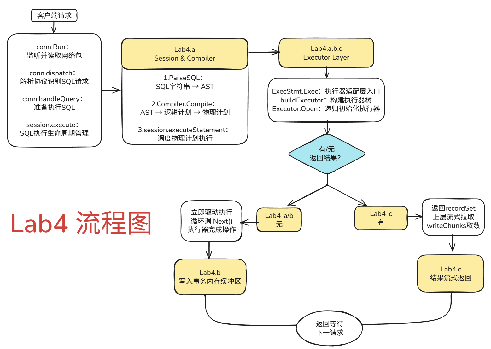

# VLDB 2021 Summer School - Lab 4 实验报告

## 实验名称：SQL 执行层的实现

## 实验目标

本次实验旨在构建 TinySQL 的核心SQL执行层，打通从客户端接收SQL请求，到解析、编译、执行，并最终与底层KV存储交互的完整数据链路。实验分为三个核心部分：

*   **Part I (Lab 4-A):** 实现通用的SQL调用链路与事务控制（`BEGIN`, `COMMIT`, `ROLLBACK`）。
*   **Part II (Lab 4-B):** 实现数据写入链路，以`INSERT`语句为代表。
*   **Part III (Lab 4-C):** 实现数据读取链路，以`SELECT`语句和高性能的并行投影（Projection）执行器为核心。

---

## 一、 实验总览与修改流程

为完成本次实验，我遵循了自顶向下、分步实现的方式，确保整个SQL执行链路的完整性和正确性。

1.  **搭建通用调用链路 (Lab 4-A)**:
    *   **首要任务**是打通从网络请求到执行器的基础通道。我在 `clientConn.Run` 中添加了对 `dispatch` 方法的调用，将网络包分发到SQL处理层。
    *   接着，我依次在 `session` 层和 `adapter` 层补全了缺失的函数调用，将一个SQL请求从字符串形态，经过解析(AST)、编译(物理计划)，最终传递到执行器入口 `ExecStmt.Exec`。
    *   最后，我重点实现了 `SimpleExec` 执行器，为 `BEGIN`, `COMMIT`, `ROLLBACK` 等事务控制语句提供了具体的执行逻辑，完成了事务状态的管理。

2.  **实现数据写入链路 (Lab 4-B)**:
    *   在通用链路的基础上，我聚焦于 `INSERT` 语句的实现。
    *   我实现了 `InsertExec` 执行器中的 `Next` 方法，使其能够处理 `VALUES` 和 `SELECT` 两种形式的数据源。
    *   通过调用链 `InsertExec.Next` -> `InsertValues.addRecord` -> `TableCommon.AddRecord`，我成功将待插入的数据行写入了当前事务的内存缓冲区 (`membuffer`)。

3.  **实现并行读取链路 (Lab 4-C)**:
    *   为了处理 `SELECT` 查询并提升性能，我实现了 `ProjectionExec` 执行器的并行计算逻辑。
    *   我重点分析并实现了 `Fetcher` 和 `Worker` 两个角色的交互：`Fetcher` 从子执行器拉取数据并分发任务；`Worker` 并行执行计算并将结果返回。
    *   通过对 Go channel 的正确使用，我构建了一个高效的、支持流式处理的并行投影流水线，完成了数据读取的最后一环。

---

## 二、 详细设计与实现

### Part I: SQL 通用调用链路 (Lab 4-A)

#### 1. 链路概览

首先，下图展示了本次实验所构建的完整SQL执行链路，其中 **Lab 4-A** 的工作是搭建了整个流程的骨架。



#### 2. `server/conn.go`: 连接与分发层

*   **背景与目标**: `clientConn.Run` 函数是服务器与客户端通信的起点，它在一个持续循环中接收网络数据包。我们的目标是在这个循环中，将接收到的数据包正确地分发给下游的处理器。
*   **设计思路**: `clientConn.Run` 的核心流程是在一个循环中原子地管理连接状态，从网络读取请求，然后分发给 `dispatch` 方法处理。我们需要在读取包成功后，立刻调用 `dispatch`。
*   **关键代码实现**:
    *   在 `(cc *clientConn) Run` 函数中，当 `cc.readPacket()` 成功返回数据包 `data` 后，通过原子操作将连接状态切换回 `connStatusDispatching`。
    *   紧接着，我添加了 `err = cc.dispatch(ctx, data)` 这行关键代码，将数据包的处理权交给了 `dispatch` 方法，从而连接了网络层和协议解析层。

    ```go
    // file: server/conn.go
    // func (cc *clientConn) Run(ctx context.Context)
    
    // ... 在成功读取 data, 切换完状态后 ...

    // Hint: step I.2
    // YOUR CODE HERE (lab4)DONE
    // 直接将读取到的数据包交给 dispatch 方法处理
    err = cc.dispatch(ctx, data)
    
    // ...
    ```

#### 3. `session/session.go`: 会话与编排层

*   **背景与目标**: `session` 层负责管理连接的事务状态、会话变量以及SQL的解析、编译和执行编排。`dispatch` 方法会将SQL请求路由到 `handleQuery`，并最终调用到 `session.execute`。我们的任务是确保这个调用链是通畅的。
*   **设计思路**: 这是一个线性的调用过程，我们只需根据函数定义，依次调用 `ParseSQL`, `Compiler.Compile` 和 `executeStatement` 即可。
*   **关键代码实现**: 在本部分，根据实验指导，我补全了 `session` 层中的一系列函数调用，确保SQL字符串能够被顺利地转换为可执行的物理计划。

#### 4. `executor/adapter.go`: 适配器层

*   **背景与目标**: `ExecStmt.Exec` 是连接上层 `session` 和底层执行器的适配器。它需要根据物理计划构建执行器树，并根据计划是否返回结果来决定执行策略。
*   **设计思路**:
    1.  **执行器构建**: 调用 `ExecStmt.buildExecutor` 将物理计划递归地构建成一棵执行器树。
    2.  **执行器初始化**: 调用顶层执行器的 `Open` 方法，递归初始化整棵树。
    3.  **执行模式决策**:
        *   **无结果集模式** (如 `INSERT`, `COMMIT`): 进入 `handleNoDelayExecutor` 流程，通过循环调用 `Next` 方法驱动执行器完成所有操作。
        *   **有结果集模式** (如 `SELECT`): 将 `Open` 好的执行器封装成 `recordSet` 并返回，由上层流式拉取数据。
*   **关键代码实现**: 我在此部分补全了 `buildExecutor` 和 `Open` 的调用，并实现了 `handleNoDelay` 中的判断逻辑，确保不同类型的SQL计划能够被正确地调度执行。

#### 5. `executor/simple.go`: 简单语句执行器

*   **背景与目标**: `SimpleExec` 负责实现那些不涉及复杂数据处理的“简单”SQL语句，特别是本次实验核心的事务控制语句 `BEGIN`, `COMMIT`, `ROLLBACK`。
*   **设计思路**: 在 `SimpleExec.Next` 方法中，根据传入的语句类型，分发到各自的处理函数，并调用 `session` 层提供的接口来改变事务状态。
*   **关键代码实现**: 我实现了 `executeBegin`, `executeCommit`, `executeRollback` 等函数内部的逻辑。例如，在 `executeBegin` 中调用 `session.NewTxn()` 开启新事务；在 `executeCommit` 和 `executeRollback` 中修改 `ServerStatusInTrans` 会话变量以触发或完成事务的提交/回滚。

---

### Part II: SQL 写入链路 (Lab 4-B)

#### 1. 链路概览

`INSERT` 语句的执行流程是写入链路的典型代表，其核心是将数据写入当前事务的内存缓冲区。
1.  **解析与编译**: SQL `INSERT` 语句被解析为AST，并编译成以 `INSERT` 操作为根节点的物理执行计划。
2.  **执行器初始化**: 物理计划被转换为 `InsertExec` 执行器实例并初始化。
3.  **数据处理**: `InsertExec.Next` 方法被驱动执行，根据 `INSERT` 类型（`VALUES` 或 `SELECT`）获取待插入的数据。
4.  **数据暂存**: 每一行数据通过 `InsertValues.addRecord` -> `TableCommon.AddRecord` 写入当前事务的 `membuffer`。
5.  **事务层**: 等待后续的 `COMMIT` 指令，由 `Session` 层面统一处理持久化。

#### 2. `executor/insert.go`: 写入执行器

*   **背景与目标**: `InsertExec` 是 `INSERT` 语句的具体执行者。它的 `Next` 方法需要被实现，以驱动数据从子节点流向 `membuffer`。
*   **设计思路**: `InsertExec` 的 `Next` 方法是整个写入操作的引擎。它需要循环地从其子执行器（对于 `INSERT...SELECT`）或从自身的行数据列表（对于 `INSERT...VALUES`）获取数据，并通过 `addRecord` 方法将它们添加到表中。
*   **关键代码实现**: 我填充了 `InsertExec.Next` 方法中的主要逻辑，特别是对 `insertRows`（处理 `VALUES`）和 `insertRowsFromSelect`（处理 `SELECT`）的调用。在这些函数内部，我确保了对 `InsertValues.addRecord` 的正确调用，完成了数据写入 `membuffer` 的关键一步。

---

### Part III: SQL 读取与并行投影 (Lab 4-C)

#### 1. 链路概览

`SELECT` 查询，特别是带有投影计算的场景，是数据读取链路的核心。为了提升性能，我们实现了一个并行的生产者-消费者模型。
*   **Fetcher (生产者/调度者)**: 从子执行器拉取数据，并将“待处理数据包”和“待填充结果包”成对地分发给 `Worker`。
*   **Worker (消费者/计算者)**: 接收任务，执行计算，填充结果，并通过 `done` channel 通知主线程。
*   **Main Thread (最终消费者)**: 从 `Fetcher` 处获取“结果包”凭证，等待 `Worker` 的完成信号，然后消费结果。

#### 2. `executor/projection.go`: 并行投影执行器

*   **背景与目标**: 为了高效地执行 `SELECT col1, col2+10 FROM ...` 这样的投影计算，我们需要实现 `ProjectionExec` 的并行执行逻辑，协调 `Fetcher`, `Worker` 和 `Main Thread` 的工作。
*   **设计思路**:
    *   主线程 (`ProjectionExec.Next`) 等待 `e.outputCh` 中的 `projectionOutput` 对象，这是一个“结果凭证”。
    *   `Fetcher` 线程在分发任务给 `Worker` **之前**，就将这个 `output` 对象放入 `e.outputCh`，让主线程可以提前开始等待。
    *   `Fetcher` 将成对的 `input`（含数据）和 `output`（空结果壳）发送到指定 `Worker` 的私有通道 (`targetWorker.inputCh`, `targetWorker.outputCh`)。
    *   `Worker` 从自己的通道中接收任务，执行计算，并通过 `output.done` 通知主线程，然后归还 `input`。
*   **关键代码实现**: 我重点实现了 `projectionInputFetcher.run` 函数。

    1.  **提前发送结果凭证**: 添加 `f.globalOutputCh <- output`，将空的 `output` 对象（但包含用于通知的 `done` channel）提前发送给主线程。
    2.  **分发任务给 Worker**: 在从子执行器获取数据 `input.chk` 后，添加了以下两行代码，将数据和结果坑位精确地传递给目标 `Worker`。

    ```go
    // file: executor/projection.go
    // func (f *projectionInputFetcher) run(ctx context.Context)
    
    // ... 在获取了 input 和 output, 并从 child 拉取数据后 ...

    // Give the input and output back to worker
    // Hint: step III.3.2
    // YOUR CODE HERE (lab4)DONE
    // 将填充了数据的 projectionInput 发送到目标工作线程的 inputCh
    targetWorker.inputCh <- input
    // 将空闲的 projectionOutput 发送到目标工作线程的 outputCh，供工作线程存储计算结果
    targetWorker.outputCh <- output
    ```
    此外，我也根据指导填充了 `projectionWorker.run` 中接收任务和归还 `input` 的代码，确保了整个并行计算模型的闭环。

---

## 三、 测试与验证

在完成 `Lab 4-A`, `4-B`, `4-C` 的所有代码填充后，我执行了 `make lab4` 命令对项目进行了完整测试。所有的测试用例均成功通过，验证了本次实验实现的正确性和完整性。


